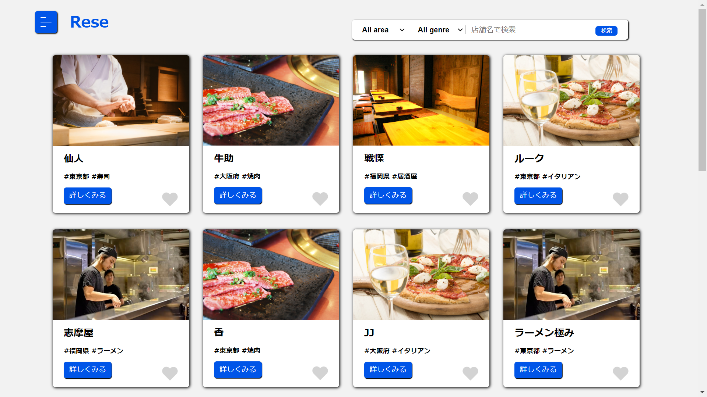
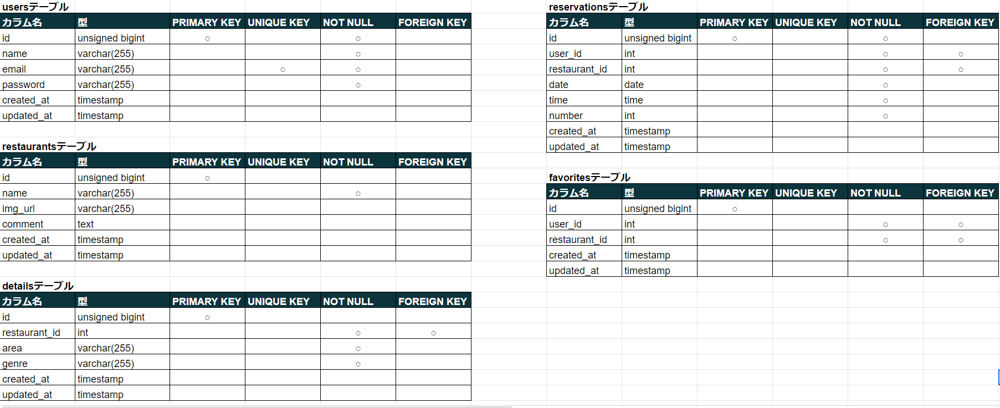
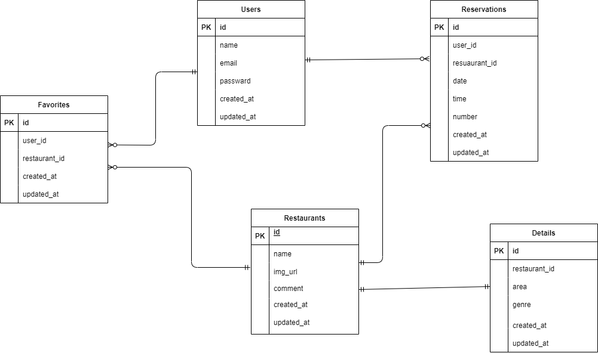

# Rese
様々な飲食店の一覧と詳細情報を見ることができます。また、ログインをすることで、予約とお気に入り登録が可能です。

## 作成した目的
自社の予約サービスを持つため

## 機能一覧
- ログイン機能
- 飲食店検索機能
- 予約機能
- お気に入り機能

## 使用技術
- Laravel9.x

## テーブル設計

## ER図

# 環境構築
- php artisan migrate(必要なテーブルを作成する)
- 初期データを入力する(php artisan db:seed)

